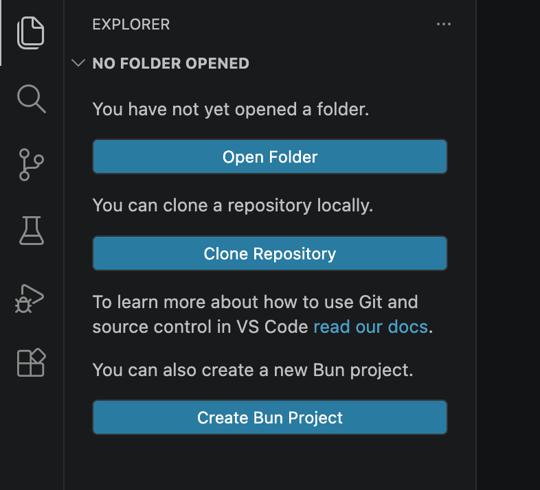

# Create Bun Project

Easy way to create new [Bun](https://bun.sh) projects in VS Code. This extension adds a 'Create Bun Project' command that walks through `bun init` CLI process via VS Code dialogs.

Features:

- **Explorer welcome screen button** so you can quickly get started
- **Template selection dialog** that enumerates the available Bun templates

Requires [Bun](https://bun.sh) to be installed globally.
